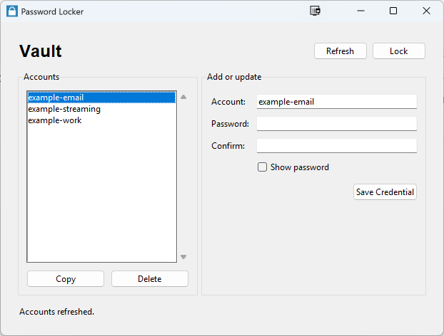

# Password Locker

[](https://github.com/mevorahde/pw_locker/actions/workflows/tests.yml)
[](LICENSE)

**Python 3.10+**

Password Locker is a local encrypted password vault with command-line and Tkinter interfaces. It is designed as a focused portfolio project: small enough to study, but structured around authenticated encryption, explicit trust boundaries, testable process integrations, and modern Python packaging.

## Overview

The application stores credentials in a user-local SQLite vault rather than a remote service. A master password unlocks the vault for the current process; stored credential passwords are encrypted and authenticated before they reach SQLite. The CLI supports scripting-friendly account operations without accepting passwords as command-line arguments, while the GUI provides the same vault behavior through a controller that is tested independently from Tkinter.

The project emphasizes practical defensive engineering: narrow database queries, parameter validation, generic error handling, conditional clipboard cleanup, deterministic account normalization, and automated tests around tampering and failure cases.



## Features

- Authenticated local vault backed by a versioned SQLite schema
- scrypt-based master-key derivation with bounded work parameters
- AES-256-GCM encryption with record-specific authentication context
- CLI commands to initialize, add, retrieve, list, and delete credentials
- Modern Tkinter GUI with create, unlock, edit, copy, delete, lock, and password-visibility controls
- Password prompts that do not echo in the CLI
- Clipboard copying without printing stored passwords
- Conditional clipboard clearing after 30 seconds by default, without overwriting newer clipboard content
- Normalized, case-insensitive account lookup with deterministic listing
- Headless controller and GUI-import tests that do not open a window
- Automated tests for cryptographic tampering, malformed metadata, CLI behavior, GUI workflows, and packaging

## Security design

Password Locker uses established primitives from PyCryptodome rather than custom cryptography.

- A 32-byte encryption key is derived from the master password with **scrypt** and a fresh cryptographically random salt.
- Credential passwords use **AES-256-GCM** authenticated encryption.
- Every encrypted value receives a fresh 12-byte nonce.
- The normalized account name is authenticated as associated data, preventing encrypted records from being swapped between accounts undetected.
- An authenticated verifier allows an incorrect master password to be rejected even when the vault contains no credentials.
- Stored scrypt parameters are validated against bounded limits before key derivation.
- The master password and derived encryption key are never stored in the database.
- Cryptographic authentication and malformed-database failures are translated into concise domain errors rather than exposing low-level details.

## Installation from source

Clone the repository and create a virtual environment:

```powershell
git clone https://github.com/mevorahde/pw_locker.git
cd pw_locker
python -m venv .venv
.\.venv\Scripts\Activate.ps1
python -m pip install --upgrade pip
python -m pip install .
```

On macOS or Linux, activate the environment with `source .venv/bin/activate` instead.

For development, install the package and test dependencies in editable mode:

```powershell
python -m pip install -e ".[dev]"
```

Tkinter is provided by the Python installation rather than PyPI. Ensure the selected Python distribution includes Tk support before using the GUI.

## GUI usage

Launch the installed GUI entry point:

```powershell
password-locker-gui
```

On first launch, create a vault and choose a non-empty master password. Later launches show the unlock screen. Stored passwords are never displayed by the vault view; they can be copied to the clipboard for the selected account. The GUI schedules clipboard cleanup without blocking its event loop and locks the active session on request.

## CLI usage

Passwords are always requested interactively and are never accepted as command-line options or environment variables.

Create a vault:

```powershell
password-locker init
```

Add or update an account:

```powershell
password-locker set ACCOUNT
```

Copy one account's password to the clipboard:

```powershell
password-locker get ACCOUNT
```

List normalized account names:

```powershell
password-locker list
```

Delete an account with interactive confirmation:

```powershell
password-locker delete ACCOUNT
```

Use `password-locker delete ACCOUNT --yes` to skip the deletion prompt. The `get` command accepts `--clear-after SECONDS` within a bounded range. A custom vault can be selected by placing the global option before the command, for example `password-locker --vault C:\path\to\vault.db list`.

The default vault location is:

```text
~/.password_locker/vault.db
```

## Testing

Install the development dependencies and run:

```powershell
python -m pytest -q
```

The suite uses temporary databases, fake clipboard and scheduler boundaries, low injected test KDF settings, and headless GUI tests. Production KDF defaults remain unchanged.

## Project structure

```text
password_locker/
  __init__.py          Public vault API exports
  __main__.py          python -m password_locker entry point
  cli.py               argparse command-line interface
  gui.py               Tkinter presentation layer
  gui_controller.py    Widget-free GUI session controller
  paths.py             Shared user-local paths
  vault.py             Cryptography and SQLite vault core
tests/                  Vault, CLI, GUI, and packaging tests
pyproject.toml          Build metadata, dependencies, and installed commands
SECURITY.md             Vulnerability-reporting and support policy
```

## Threat model and limitations

The project protects credential passwords stored in a local vault against offline disclosure and undetected record modification when the attacker does not know the master password. It does not claim to secure a fully compromised host or replace operating-system protections.

- Forgotten master passwords cannot be recovered.
- Master-password rotation is not currently implemented.
- Account names and record counts remain visible in SQLite metadata.
- Clipboard confidentiality depends on the operating system and other applications.
- Filesystem access controls depend on the host operating system.
- Python cannot guarantee complete in-memory secret zeroization.
- Database rollback or replacement protection requires external backup or filesystem controls.
- The legacy `users.db` format is unsupported and is not automatically migrated.
- This project has not received an independent professional security audit.

Password Locker is not presented as unbreakable, production-certified, enterprise secret management, or a substitute for a professionally reviewed password manager.

## License

Password Locker is available under the [MIT License](LICENSE).

## Project history

Password Locker began as an automation exercise inspired by *Automate the Boring Stuff with Python*. The original learning project used legacy scripts and packaging patterns. Version 2.0 redesigns the repository around an authenticated local vault, isolated interfaces, modern packaging, explicit security boundaries, and a comprehensive automated test suite.
